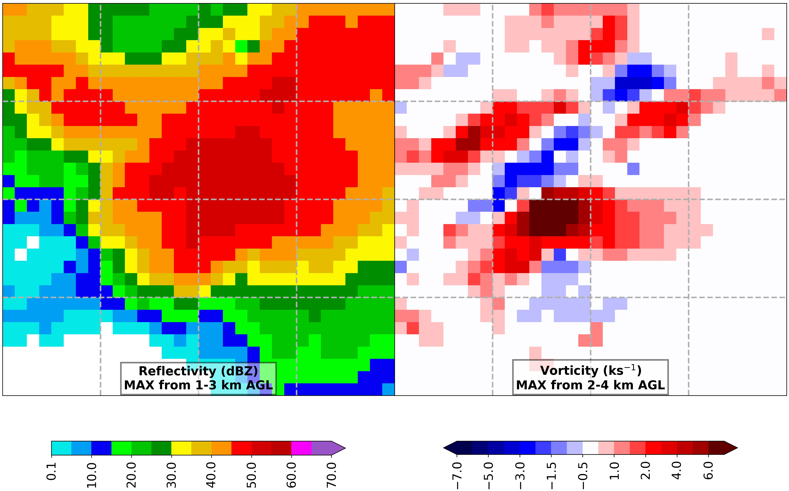
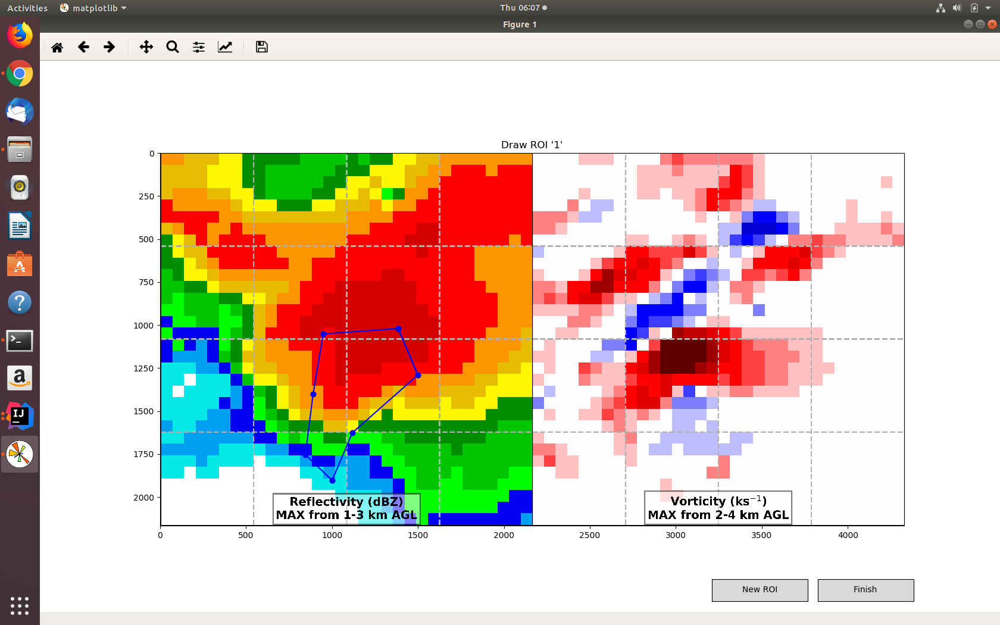

# StormLabeler

This library facilitates two human experiments.  The goal is to determine if machine learning can discover new knowledge about tornadoes.  You will be asked to label storm-centered radar images, some of tornadic storms and some of non-tornadic storms.  Your labels will be compared with a convolutional neural network (CNN).

Once you have labeled as many storms as you want, we ask that you e-mail your labels to [ryan.lagerquist@ou.edu](mailto:ryan.lagerquist@ou.edu).  The labels will be anonymized and contain no personally identifiable information.  By e-mailing your labels, you consent for them to be used in academic research.

## Download and Installation

Run the following commands in a Linux terminal.

`git clone https://github.com/thunderhoser/StormLabeler.git`  
`cd stormlabeler`  
`python setup.py install`  

This should install StormLabeler and all the packages on which it depends.

## Experiment 1: Regions of Interest

In this experiment you will draw regions of interest for each storm.  Specifically, you will outline regions of the storm that, in your mind, contain evidence for next-hour tornado occurrence.  In other words, you will outline regions that most strongly support the prediction that the storm will be tornadic at *some* time in the next hour.

Please follow the steps below.

 1. **Download storm images** from [here](https://drive.google.com/file/d/1KkjNFr6rTcwTJfbUMzKZhA74Ns7AS3Up/view?usp=sharing).  Unzip the storm images to a directory on your machine.  Henceforth, I will assume that this directory is `/home/thunderhoser/experiment1`.
 
 2. **Run the script** `capture_human_polygons.py`.  This requires two input arguments:
    - Input directory, containing the storm images that you just downloaded
    - Output directory, where you want your regions to be saved
    
    Run the following command from a Linux terminal (your input and output directories will probably be different).
    
    `python capture_human_polygons.py -i "/home/thunderhoser/experiment1" -o "/home/thunderhoser/experiment1/human_regions"`
    
    The script will read storm images and present them to you, one at a time.  You may draw as many regions as you want on top of each storm, indicating where you find the most evidence for next-hour tornado occurrence.  If you believe that no part of the storm contains evidence for next-hour tornado occurrence, just click "Finish" without drawing any regions.  The interface looks like this:
    
    
    
    The left panel shows maximum reflectivity from 1-3 km above ground level (AGL), and the right panel shows maximum vorticity from 2-4 km AGL.  Both grids are 32 x 32 with 1.5-km spacing (48 x 48 km), and stomrm motion is towards the right.  Colour bars are omitted from the images to be labeled.  However, if you need them as a reference, an image with colour bars is shown below.  The colour scheme (correspondence of colour to value) is the same for every storm.
    
    
    
    To draw a new region, click "New ROI".  Left-click for a new vertex and right-click to close the polygon.  If you accidentally draw an invalid polygon (with less than 3 vertices), don't worry -- it will be ignored.  Once you have drawn all the regions you want, click "Finish".  After drawing one region, the interface might look like this:
    
    
    
    After drawing two regions, the interface might look like this:
    
    
    
    **Do not feel obligated to label all the images.**  When you have labeled as many as you want, just exit the script.
    
 3. **Send results** (NetCDF files produced by the script, which contain your labels) to [ryan.lagerquist@ou.edu](mailto:ryan.lagerquist@ou.edu).  In so doing, you give your consent for the anonymized labels to be used for academic research.

## Experiment 2: Human Novelty Detection

In this experiment you will see machine-based regions of interest (according to the CNN) for each storm.  You will be asked to label regions of interest that disagree with your intuition -- *i.e.*, where the machine thinks there is strong evidence for next-hour tornado occurrence but you don't.

Please follow the steps below.

 1. **Download storm images** from [here](FOO).  Unzip the storm images to a directory on your machine.  Henceforth, I will assume that this directory is `/home/thunderhoser/experiment2`.
 
 2. **Run the script** `capture_human_mouse_clicks.py`.  The script requires two input arguments: the input and output directory.  Run the following command from a Linux terminal (your input and output directories will probably be different).
    
    `python capture_human_mouse_clicks.py -i "/home/thunderhoser/experiment2" -o "/home/thunderhoser/experiment2/human_labels"`
    
    The script will read storm images and present them to you, one at a time.  To label a region of interest as novel or unexpected, just click inside it.  A black diamond will show up wherever you click.  If you find no regions novel or unexpected, simply close the image and move on to the next one.  The interface looks like this:
    
    
    
    After labeling a few regions, the interface might look like this.  You can click in either panel -- the reflectivity or vorticity panel.
    
    

 3. **Send results** (NetCDF files produced by the script, which contain your labels) to [ryan.lagerquist@ou.edu](mailto:ryan.lagerquist@ou.edu).  In so doing, you give your consent for the anonymized labels to be used for academic research.
